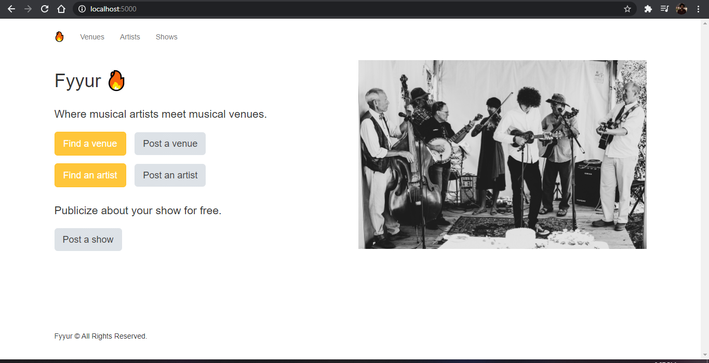

Fyyur
-----

Fyyur is a musical venue and artist booking site that facilitates the discovery and bookings of shows between local performing artists and venues. This site lets you list new artists and venues, discover them, and list shows with artists as a venue owner.

## Functionalities
* Connect to PostgreSQL Database.
* Creating new venues, artists, and creating new shows.
* Searching for venues and artists.
* Learning more about a specific artist or venue.

## Installation
```
pip install -r requirements.txt
```

## Tech Stack
* Python
* Flask
* Flask-Migrate
* SQLAlchemy
* PostgreSQL
* HTML, CSS, Javascript and Bootstrap3

## Overview

### Home Page


### Shows


### Venue


### Artist

